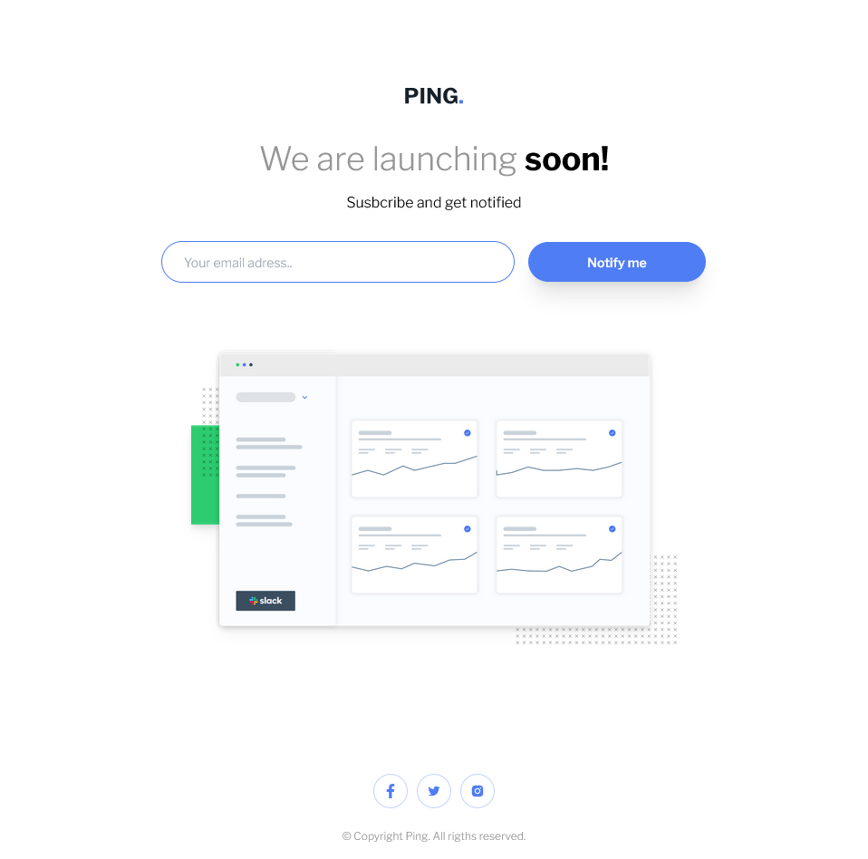

# notification-page-main

### Screenshot

### The challenge

Users should be able to:

- View the optimal layout for the site depending on their device's screen size

- See hover states for all interactive elements on the page

- Receive an error message when the form is submitted if:

  - The input field is empty
  - The email address is not formatted correctly

### Links

- Solution URL: [https://github.com/DaniilBaida/ping-coming-soon-page-master](https://github.com/DaniilBaida/ping-coming-soon-page-master)

## Author

- Linked in - [Daniil Baida](https://www.linkedin.com/in/daniil-baida-689b7b221/)

- Frontend Mentor - [@DaniilBaida](https://www.frontendmentor.io/profile/DaniilBaida)
